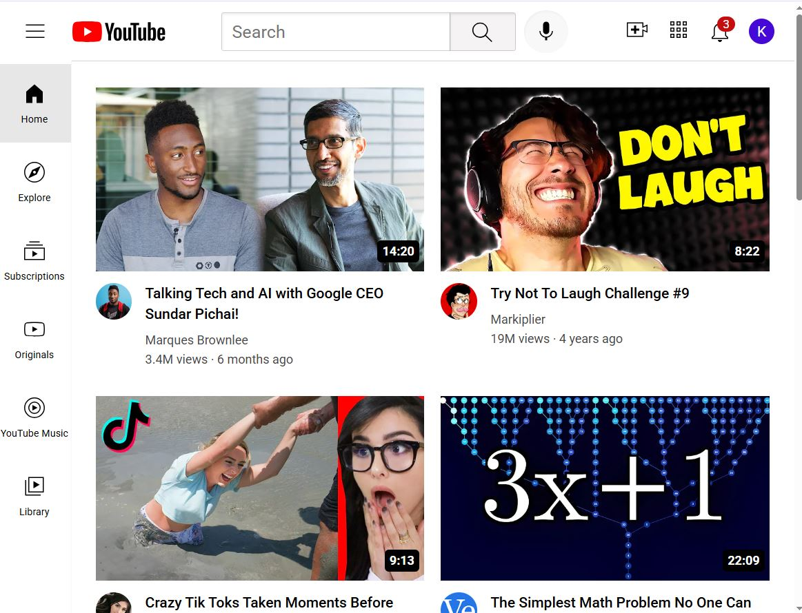
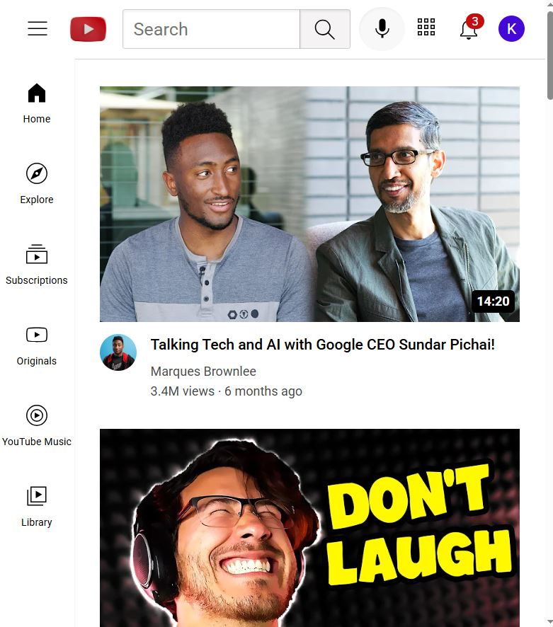

# My Youtube Clone Application
 &nbsp; &nbsp; &nbsp; &nbsp; &nbsp; &nbsp; YouTube clone project built using HTML, CSS, JS and React focuses on replicating the basic layout and features of YouTube’s interface. By making the clone ultra more responsive, you ensure that it adapts well to different screen sizes, such as desktops, tablets, and smartphones.  project recreates the visual and interactive design of YouTube’s main interface using React functional components, organized component structure, modular CSS, and dummy data for rendering video content dynamically.

## Tech Used:
 - HTML5
 - CSS3
 - JavaScript
 - ReactJS

## Key Features of the YouTube Clone:
### 1. Component-Based Architecture
- This clone follows a modular design pattern by breaking down the UI into reusable React components like Navbar, Sidebar, and Home.
- Each component is responsible for a distinct part of the UI, making the code cleaner, scalable, and easier to maintain or extend.

### 2. Dynamic Data Rendering
- Video content is rendered dynamically using a centralized data array (media.js) containing thumbnail URLs, titles, channel info, and video links.
- React’s .map() method is used to iterate through the data and display each video card, simulating a real YouTube feed.

### 3. Interactive Video Cards
- Each video card includes a thumbnail, channel icon, title, and metadata, and links directly to the YouTube video.
- The thumbnail also features an overlay showing the video duration, mimicking the actual YouTube UI.

### 4. Perfect Navbar
- The Navbar component replicates the top section of YouTube's interface with interactive icons and input elements.
- It includes a hamburger menu, YouTube logos, a un-functional search bar (UI only), voice search, upload, apps, notifications, and a profile placeholder, all styled with tooltips for better usability.

 ### 5. Tooltip User Feedback
 - Hovering over action buttons like "Search", "Create", and "Notifications" shows helpful tooltips.
This improves user experience by providing context and feedback for icon-based buttons.

### 6. Responsiveness:
 - **Media Queries:** CSS media queries are used extensively to make the layout adapt to different screen sizes. For example:
On larger screens (desktops), medium screens (laptop, tabs), small screens (mobiles, etc..) and might have a fixed sidebar and a wide grid for video thumbnails.
 - **Flexbox/Grid Layout:** Flexbox and CSS Grid are helpful for creating dynamic layouts that change according to the screen width. The video thumbnails will be arranged in a grid on larger screens and switch to a single-column layout on smaller screens.
 - **Responsive Images:** Images, such as video thumbnails, are set to be responsive, adjusting their size based on the screen width to avoid breaking the layout.

[Repo link](https://github.com/Karthikr32/my-youtube)  
[Demo link](https://my-youtube-six-henna.vercel.app/)  

## Screenshots
  
  
  
  
